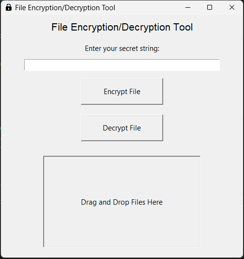
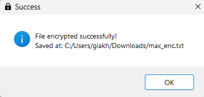
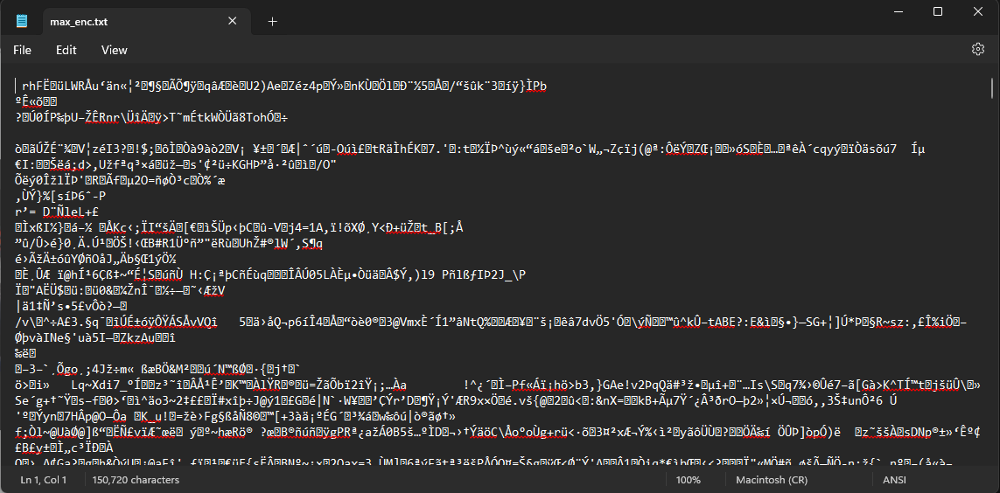
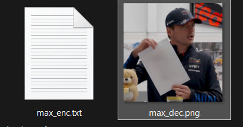

# Chacha20 application in secure file encryption system

## Introduction

This project implements a secure file encryption system using the ChaCha20 encryption algorithm. It provides a reliable and efficient way to encrypt and decrypt files, ensuring data confidentiality and integrity. The application is designed to prioritize speed and security, making it suitable for protecting sensitive information in various environments.

## Report

Read more: [Chacha20 application in secure file encryption system on personal computer](UET_report.pdf)

## How to Use

### Prerequisites
- Python 3.12
- C++ compiler (for compiling the C++ code)
- Install libraries:
    ```sh
    pip install pycryptodome
    pip install tk
    ```

### Setup
1. Clone the repository:
    ```sh
    git clone https://github.com/khanhtran0111/Secure-file-encryption-system.git
    cd Secure-file-encryption-system
    ```

2. Compile the C++ code:
    ```sh
    g++ -o chacha20_file_processor src/chacha20.cpp
    ```

### Usage

#### Encrypt a File
1. Run the Python application:
    ```sh
    python src/app.py
    ```

2. In the GUI, select the file you want to encrypt.
3. Enter your secret key, which will be converted to the encryption key (32 bytes) and nonce (12 bytes).
4. Choose the output format (binary).
5. Click the "Encrypt" button.

#### Decrypt a File
1. Run the Python application:
    ```sh
    python src/app.py
    ```

2. In the GUI, select the file you want to decrypt.
3. Enter your previous secret key for encryption, which will be converted to the encryption key (32 bytes) and nonce (12 bytes).
4. Choose the output format (the format before encryption).
5. Click the "Decrypt" button.

### Example

For example, I have an image that needs to be encrypted:


Next, I run the app:


Now, you can see the main app. There is a box for you to enter your secret string for making the key and nonce for the algorithm. There are two buttons, `Encrypt File` and `Decrypt File`, for actions and a box where you can drag and drop your specific file.



I will put my secret string in the box. For example, my string is `simply lovely`, then I choose `Encrypt File` and pick the file which is going to be encrypted.


And done!



The information after being encrypted will be saved in a file with the extension `.txt`.



If I want to see what that file is, I enter the secret string used for encryption, choose `Decrypt File`, and enter the name with the original file format (.jpg, .pdf, etc.).

Boom, now I have two images, one is the original, and one is decrypted from the encrypted txt file.


